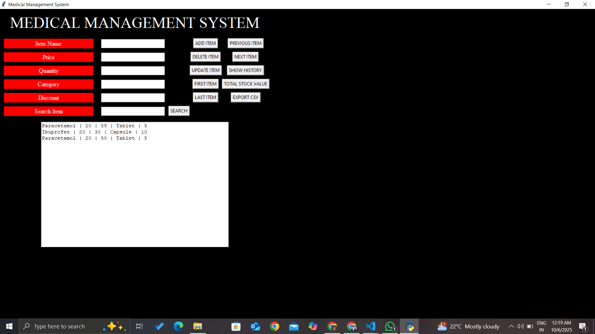

# Medical Management System (MMS)

A **Python Tkinter-based Medical/Pharmacy Management System** to manage medicines, stock, and inventory efficiently.

---

## Features

- **CRUD Operations**
  - Add, Delete, Update items
  - Navigate: First / Last / Previous / Next items
- **Search Functionality**
  - Search items by any field (name, category, etc.)
- **Stock Management**
  - Calculate total stock value (`price × quantity`)
  - Exchange two items in the database
- **History Display**
  - View all items in a scrollable history text area
- **Export Database**
  - Export current database to CSV for backup
- **Extra Features**
  - Placeholder for sorting by price or quantity
  - Ready for low-stock alerts and reporting

---
**Screenshots**
**Main Window:**



## Installation

1. Make sure you have **Python 3.x** installed
2. Install Tkinter (usually comes with Python)
3. Download or clone this repository:

```bash
git clone https://github.com/<YOUR_USERNAME>/Medical_Management_System.git
cd Medical_Management_System
